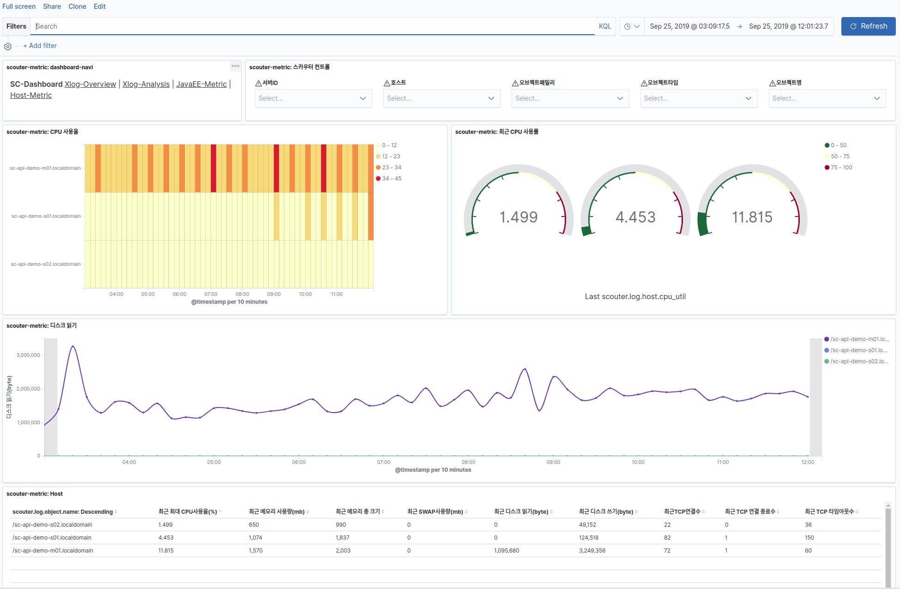

# filebeat-scouter-module
Filebeat scouter module

# Installtion Steps
1. Download and unzip Filebeat 
1. Edit the filebeat.yml configuration file
1. Dashboard Setup 
   1. all(scouter include) dashboard setup <br/>```./filbebeat setup```
   1. online scouter dashboard setup <br/>```./filebeat setup -E setup.dashboards.zip=https://github.com/eskrug/filebeat-scouter-module/releases/download/7.3.3/scouter-dashboard.zip```
   1. zip file scouter dashboard setup <br/>```./filebeat setup -E setup.dashboards.zip=scouter-dashboard.zip```    
1. Set scouter module <br/>```./filebeat modules enable scouter``` 
1. Edit the modules.d/scouter.yml configuration file
1. Start the daemon by running sudo <br/>```./filebeat -e -c filebeat.yml```

# modules.d/scouter.yml 설명 
```
- module: scouter
  # All logs
  log :
    enabled: true
    # Set custom paths for the log files. If left empty,
    # Filebeat will choose the paths depending on your OS.
    # 스카우터 메트릭 로그 파일 위치와 파일 패턴을 설정한다. 
    var.paths:
     - /path/scouter/server/ext_plugin_filelog/scouter-*.json                                                                        
```
# 데모 
 - [스카우터 샘플 로그 기반 엘라스틱 연동 데모](./demo/SCOUTER-LOG-DEMO.md)    
# 운영  
 - 스카우터를 운영중이라면 스카우터 메트릭 로그 플러그인을 설치하여 스카우터 서버를 재시작한다.
   -  자세한 내용은 여기 주소로 https://github.com/scouter-contrib/scouter-plugin-server-metriclog 들어가 확인한다.    
# support elastic version 
1. elastic search version : 7.x 이상  
# dashboards 종류
- scouter xlog overview
  - xlog 기반 오버뷰 가시화  

- scouter xlog analysis
  - xlog 기반 서비스 분석 가시화

- scouter javaee metric
  - javaee 관련 성능 데이터 가시화

- scouter host metric
  - OS 관련 성능 데이터 가시화


