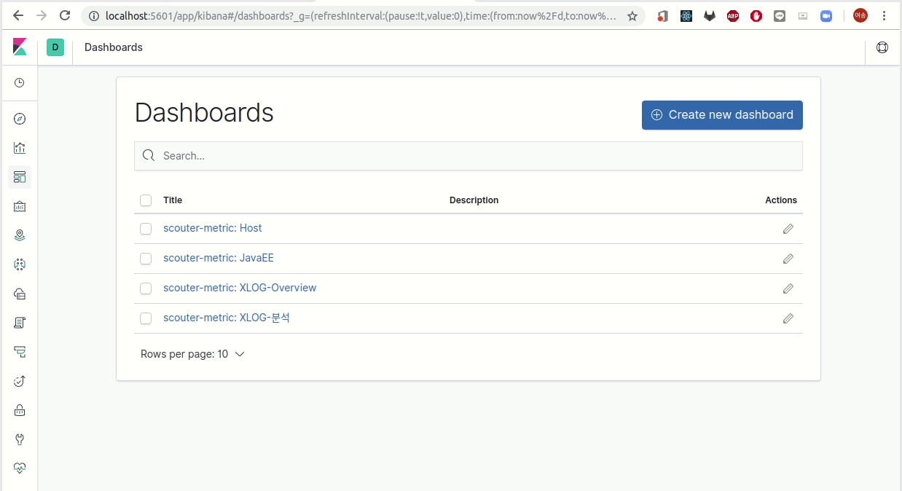
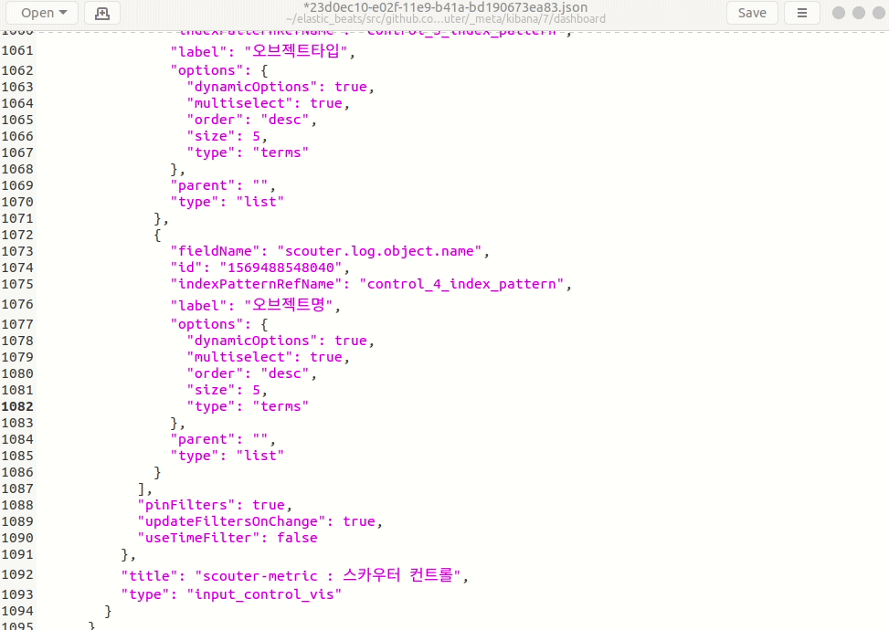

## filebeat module 신규 dashboard 만들기
전제는 filbeat 신규 모듈로 키바나에서 대시보드를 만들었고 이를 다시 filbeat 모듈에 내재 하고자 한다고 가정하겠습니다. 
  
  

```
$ cd ${GOPATH}/src/github.com/elastic/beats/filebeat
$ MODULE=scouter ID=23d0ec10-e02f-11e9-b41a-bd190673ea83 mage exportDashboard
$ vi module/scouter/module.yml
```

[](https://asciinema.org/a/273008)

export를 받으면 대시보드 관련된 차트와 index pattern 정도를 내려 받습니다. 

```
module/scouter/log
├── manifest.yml
├── config
│   └── {fileset}.yml
├── ingest
│   └── pipeline.json
├── _meta
│   └── fields.yml
│   └── kibana
│       └── 7
│         └──dashboards-23d0ec10-e02f-11e9-b41a-bd190673ea83.json
|             
```
index pattern 정보가 references로 구성되어 있기 때문에 레퍼런스 정보를 삭제 하고 실제 index-pattern  정보를 
filebeat-*으로 입력 합니다.

  
 
 
## dashboard만 빌드
 
```
$ cd ${GOPATH}/src/github.com/elastic/beats
$ make beats-dashboards
```

